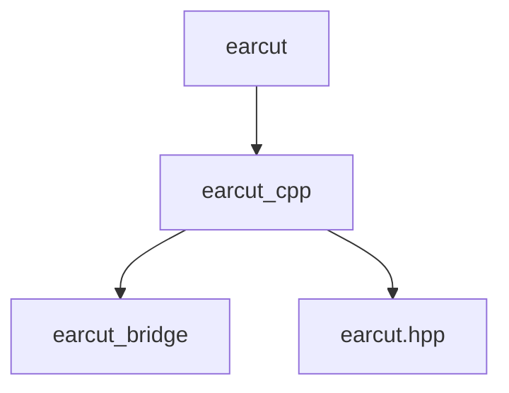

# earcut-swift

Attempt to build a Swift wrapper around MapBox's earcut cpp project for triangulating polygons.

## Project Structure

The project uses Swift Packages and Swift's new C++ interop to build a wrapper around the earcut C++ (header only) project.

### Swift Package Structure

* earcut: A Swift target that wraps and exposes a Swift only interface for earcut.
* earcut_cpp: A C++ target that consist of a header defining a SIMD/Swift Array based interface to earcut.
* earcut_bridge: A swift target that exposes a placeholder function. This exists purely so the earcut_cpp target can import and expose Swift.
* earcut.hpp: A C++ header living inside the earcut_cpp target. This is a (git submodule) copy of the earcut.hpp header from the earcut project.

The structure looks like this.

`// earcut -> earcut_cpp -> earcut_bridge`

